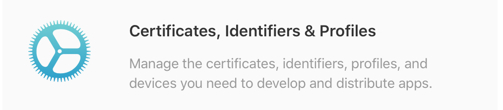

# ios打包上线

我怎么知道我打包到哪里！

在打包上线前， 最好先了解三个概念， 当然随着一次次的打包踩坑， 也会一次一次的熟悉

这三个概念是Certificates, Identifiers & Profiles

这也是苹果官网的选项题目！

## 1. Certification(证书)
证书是对电脑开发资格的认证，每个开发者帐号有一套，分为两种：
1) Developer Certification(开发证书)
安装在电脑上提供权限：开发人员通过设备进行真机测试。
可以生成副本供多台电脑安装；
2) Distribution Certification(发布证书)
安装在电脑上提供发布iOS程序的权限：开发人员可以制做测试版和发布版的程序。
不可生成副本，仅有配置该证书的电脑才可使用；（副本制做介绍在下面Keychain中介绍）
## 2. Provisioning Profile(授权文件)
授权文件是对设备如iPod Touch、iPad、iPhone的授权，文件内记录的是设备的UDID和程序的App Id，即使被授权的设备可以安装或调试Bundle identifier与授权文件中记录的App Id对应的程序。
开发者帐号在创建授权文件时候会选择App Id，（开发者帐号下App Id中添加，单选）和UDID（开发者帐号下Devices中添加最多100个，多选）。
授权文件分为两种，对应相应的证书使用：
1) Developer Provisioning Profile(开发授权文件)
在装有开发证书或副本的电脑上使用，开发人员选择该授权文件通过电脑将程序安装到授权文件记录的设备中，即可进行真机测试。
注意：确保电脑有权限真机调试，即安装了开发证书或副本；在开发工具中程序的Bundle identifier和选中使用的授权文件的App Id要一致；连接调试的设备的UDID在选中的授权文件中有记录。
2) Distribution Provisioning Profile(发布授权文件)
在装有发布证书的电脑上（即配置证书的电脑，只有一台）制做测试版和发布版的程序。
发布版就是发布到App Store上的程序文件，开发者帐号创建授权文件时选择store选项，选择App Id，无需选择UDID；
测试版就是在发布之前交给测试人员可同步到设备上的程序文件，开发者帐号创建授权文件时选择AdHoc，选择App Id和UDID；只有选中的UDID对应的设备才可能安装上通过该授权文件制做的程序。
## 3. Keychain(开发密钥)
安装证书成功的情况下证书下都会生成Keychain，上面提到的证书副本就是通过配置证书的电脑导出Keychain（就是.p12文件）安装到其他机子上，让其他机子得到证书对应的权限。Developer Certification就可以制做副本Keychain分发到其他电脑上安装，使其可以进行真机测试。
注意：Distribution Certification只有配置证书的电脑才可使用，因此即使导出导出Keychain安装到其他电脑上，其他电脑也不可能具有证书的权限。

## 参考链接

[iOS Development和iOS Distribution有什么区别](https://zhidao.baidu.com/question/1495336742026618619.html)

## 技术 